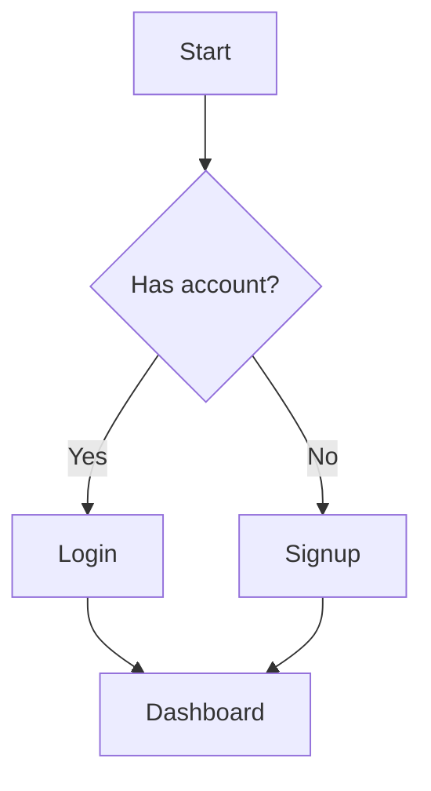

# UX Mockup

Generate ASCII art mockups for UI decisions. Visual > verbal for design discussions.

## When to Use

- New component or page design
- User asks "what should this look like"
- Comparing layout approaches
- Before coding any UI

## Rules

1. **Always show 2-3 options** - Never just one
2. **Mobile-first** - Start narrow, then show desktop
3. **Label clearly** - Option 1, Option 2, etc.
4. **Show real data** - Not "Lorem ipsum"
5. **Include dimensions** - Approximate px where helpful
6. **Note trade-offs** - Pros/cons for each option

## ASCII Art Vocabulary

### Borders and Containers
```
┌─────────────────┐  ╭─────────────────╮
│  Square box     │  │  Rounded box    │
└─────────────────┘  ╰─────────────────╯

┌─────────┬───────┐
│  Left   │ Right │  Split container
└─────────┴───────┘
```

### Common Elements
```
[  Button  ]     Primary button
( Secondary )    Secondary/outline
●○○              Pagination dots
■■■■░░░░░░       Progress bar
☐ Unchecked      ☑ Checked
★ ★ ★ ☆ ☆        Rating
⟨ Back           Chevron left
Next ⟩           Chevron right
↑ ↓ ← →          Arrows
⋮                More menu (vertical)
⋯                More menu (horizontal)
🔒               Locked/premium
```

### Inputs
```
┌──────────────────────┐
│ Placeholder text...  │  Text input
└──────────────────────┘

┌──────────────────────┐
│ Select option      ▼ │  Dropdown
└──────────────────────┘

( ● Option A )  ( ○ Option B )  Radio buttons

[ ☑ ] Remember me                Checkbox
```

### Cards
```
┌────────────────────────┐
│ ┌────┐ Title Here      │
│ │ 🖼 │ Subtitle text   │
│ └────┘                 │
│ Description goes here  │
│ with multiple lines... │
├────────────────────────┤
│ [ Action ]   ( Cancel )│
└────────────────────────┘
```

### Charts
```
Donut:           Bar:
   ╭──P──╮       ████████░░░░ 80%
  F│ 42 │C       ██████░░░░░░ 60%
   ╰─────╯       ████░░░░░░░░ 40%
```

### Navigation
```
┌─────────────────────────────┐
│ ☰  App Name          🔔 👤  │  Top nav
└─────────────────────────────┘

┌─────────────────────────────┐
│  🏠     📋     ➕     👤    │  Bottom nav
│ Home   List   Add   Profile │
└─────────────────────────────┘

│ ● Dashboard    │
│ ○ Settings     │  Sidebar
│ ○ Help         │
```

## Mobile vs Desktop

### Mobile First (320-428px)
```
┌─────────────────────┐
│ ☰  Title       🔔   │
├─────────────────────┤
│                     │
│   ┌─────────────┐   │
│   │   Card 1    │   │
│   └─────────────┘   │
│                     │
│   ┌─────────────┐   │
│   │   Card 2    │   │
│   └─────────────┘   │
│                     │
├─────────────────────┤
│ 🏠    📋    ➕    👤 │
└─────────────────────┘
```

### Desktop (lg: breakpoint)
```
┌──────────────────────────────────────────────────────┐
│ Logo        Dashboard   Settings   Help     🔔  👤   │
├────────────────────┬─────────────────────────────────┤
│                    │                                 │
│  ● Dashboard       │  ┌──────────┐  ┌──────────┐    │
│  ○ Analytics       │  │  Card 1  │  │  Card 2  │    │
│  ○ Settings        │  └──────────┘  └──────────┘    │
│                    │                                 │
│  ─────────────     │  ┌──────────┐  ┌──────────┐    │
│  Recent            │  │  Card 3  │  │  Card 4  │    │
│  • Item 1          │  └──────────┘  └──────────┘    │
│  • Item 2          │                                 │
│                    │                                 │
└────────────────────┴─────────────────────────────────┘
  Sticky sidebar                Grid layout
```

## Output Format

```markdown
## {Component/Page} Options

### Option 1: {Name}
```
{ASCII mockup}
```
**Pros:** {benefits}
**Cons:** {drawbacks}

### Option 2: {Name}
```
{ASCII mockup}
```
**Pros:** {benefits}
**Cons:** {drawbacks}

### Option 3: {Name} (if needed)
```
{ASCII mockup}
```
**Pros:** {benefits}
**Cons:** {drawbacks}

### Desktop Variant (if different)
```
{wider ASCII mockup}
```

### Recommendation
{Which option and why, or "depends on X"}
```

## Example: Macro Display Options

```markdown
### Option 1: Stacked Bars
┌─────────────────────────────────────┐
│ DAILY MACROS                        │
├─────────────────────────────────────┤
│  P ████████░░░░░░░░░░░░░░░░░ 180g   │
│  C ██████░░░░░░░░░░░░░░░░░░░ 165g   │
│  F ███░░░░░░░░░░░░░░░░░░░░░░  88g   │
│  ─────────────────────────────────  │
│  Daily Calories              2200   │
└─────────────────────────────────────┘
**Pros:** Clear ratios, scannable
**Cons:** Takes vertical space

### Option 2: Mini Donut (compact)
┌─────────────────────────────────────┐
│ DAILY MACROS                        │
├─────────────────────────────────────┤
│    ╭──P──╮    ● P  180g             │
│   F│2200│C    ● C  165g             │
│    ╰─────╯    ● F   88g             │
└─────────────────────────────────────┘
**Pros:** Compact, shows percentages visually
**Cons:** Harder to compare exact values
```

## Complex Flows

For multi-step flows, use Mermaid (per CLAUDE.md):



Only use Mermaid for:
- Multi-step user journeys
- State machines
- Decision trees
- Data flow

Use ASCII for static layouts.
