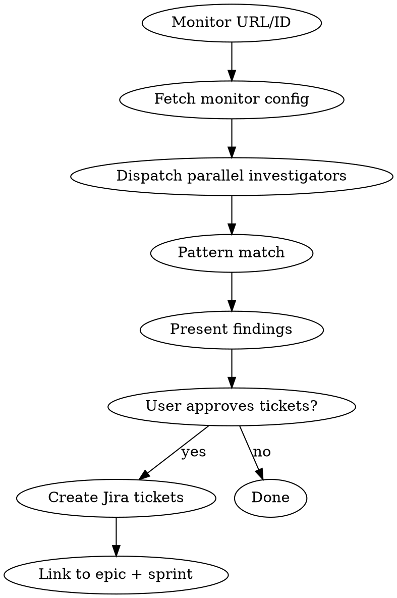

# Alert Triage

Investigate a firing/flapping Datadog alert, identify root causes via parallel subagents, match against known anti-patterns, and create actionable Jira tickets.

## When to Use

- User shares a DD monitor URL or says an alert is noisy/flapping
- Monitor went to warn/alert overnight and recovered
- "I'm tired of this alert"
- Post-incident: "why did this fire?"
- PROACTIVE: conversation mentions alert fatigue, false positives, or overnight pages

## Workflow



### Phase 1: Extract Monitor Context

Parse the monitor URL or ID. Fetch via:
```bash
cd ~/.claude/skills/investigating-datadog/scripts
uv run dd.py monitor <ID>
```

Extract: service name, metric query, thresholds (warn/crit), window, notification targets, creation date.

### Phase 2: Parallel Investigation

Dispatch 3 subagents simultaneously using `Task` with `subagent_type="general-purpose"`:

**Agent 1 — Error Pattern Analyst**
```
Investigate error patterns for this Datadog service.

Service: <service>
Query: <from monitor>
Time range: 7d

From ~/.claude/skills/investigating-datadog/scripts, run:
1. uv run dd.py investigate "service:<service> status:error" --from 7d
2. uv run dd.py timeline "service:<service> status:error" --from 7d

Return:
- Error volume and rate (errors/min)
- Time pattern: constant, bursty, time-of-day correlated?
- Top 3 distinct error messages with counts
- Which hosts/pods are affected?
- Is it still active right now?
```

**Agent 2 — Environment & Tag Auditor**
```
Audit the environment tagging for this Datadog service to find cross-env pollution.

Service: <service>

From ~/.claude/skills/investigating-datadog/scripts, run:
1. uv run dd.py logs "service:<service> status:error" --from 24h --limit 200
2. uv run dd.py traces "service:<service>" --from 24h

Analyze ALL returned hosts/pods and return:
- List of unique hosts with their apparent environment (prod/qa/staging/dev)
- Any hosts whose name contains qa/staging/dev but appear in env:prod data
- Any hosts generating disproportionate error volume
- Tag inconsistencies (e.g., env:prod on a QA node)
```

**Agent 3 — Monitor Health Analyst**
```
Analyze the health and tuning of this Datadog monitor.

Monitor ID: <id>
Query: <query>
Thresholds: warn=<w> crit=<c>
Window: <window>

From ~/.claude/skills/investigating-datadog/scripts, run:
1. uv run dd.py events --from 14d
2. uv run dd.py metrics "<the monitor's metric query>" --from 7d

Return:
- How many times has this monitor transitioned in 14d? (alert/warn/ok)
- Is it flapping? (>3 transitions in 7d = flapping)
- Does the metric show time-of-day patterns (e.g., low traffic overnight)?
- Are thresholds appropriate given the metric's baseline?
- Is require_full_window set? Should it be?
- Recovery threshold present?
```

### Phase 3: Pattern Match

After agents return, check findings against the Known Anti-Patterns table below. For each match, note the pattern name and recommended fix.

### Phase 4: Present Findings

Format a summary for the user:

```
## Alert Triage: [Monitor Name]

### Root Causes Found
1. **[Pattern Name]**: [1-2 sentence description]
2. **[Pattern Name]**: ...

### Investigation Details
[Key data points from agents — error rates, affected hosts, timeline]

### Recommended Tickets
| # | Summary | Size | Why |
|---|---------|------|-----|
| 1 | [action] | 0.5 | [pattern match] |
| 2 | [action] | 0.5 | [pattern match] |

### Monitor Tuning
[Any threshold/config changes recommended]
```

Ask user: which tickets to create, what sprint/epic, sizing adjustments.

### Phase 5: Create Tickets

Use REST API (per CLAUDE.md patterns) to create tickets with:
- ADF description with AC + Artifacts sections
- Correct sprint ID (numeric, via `customfield_10020`)
- Story points via `customfield_10026`
- Pod label (e.g., `roip-pod-2`)
- Link to reactive work epic via issue link

## Known Anti-Patterns

| Pattern | Symptoms | Fix |
|---------|----------|-----|
| **Poison Message** | Same request ID in errors for >1h; "ACKing message anyways"; file/resource not found in loop | Dead-letter or purge the message; add DLQ with max retry count |
| **Env Tag Leakage** | QA/staging host appearing in `env:prod` metrics; error burst from non-prod host | Fix env tag at deployment level OR add `!host:*qa*` to monitor query |
| **Low-Traffic Rate Inflation** | Alert fires overnight/weekends but not during business hours; rate-based monitor on low-volume service | Add `require_full_window: true`; increase min denominator; use count-based alert for low-volume |
| **Missing DLQ** | "ACKing message anyways"; same error repeating indefinitely; error count grows linearly forever | Implement dead-letter queue with max retry (typically 3) |
| **Threshold Too Sensitive** | Warn fires on normal variance; >3 warn transitions per week without action needed | Raise warning threshold; add recovery threshold (hysteresis); widen evaluation window |
| **Missing Recovery Threshold** | Monitor flaps between OK/warn rapidly; transitions >5/day | Add recovery threshold below warning (e.g., warn at 10%, recover at 5%) |
| **Stale Resource Reference** | Error references file/path/ID that was valid days/weeks ago; timestamp in path is old | Clean up the stale reference; investigate why it wasn't cleaned up on completion |
| **Shared Service Tag** | Multiple environments share the same `service:X` tag; errors from one env pollute another's metrics | Namespace service tags by env (e.g., `service:hs-pdfworker-qa`) or add env filter to monitor |
| **Recursive/Stack Overflow** | "maximum recursion depth exceeded"; "stack overflow"; rapid-fire identical errors (10+/sec) | Catch RecursionError; add recursion depth guard; route malformed input to manual review |
| **Deploy Correlation** | Errors started exactly when a deployment occurred; Watchdog flagged deployment | Rollback or fix the deployment; add deployment event correlation to monitor |

## Quick Reference

| Need | Where |
|------|-------|
| DD investigation tools | `~/.claude/skills/investigating-datadog/scripts/dd.py` |
| Jira REST API patterns | Project CLAUDE.md — REST API v3 section |
| Epic link types | `99 Parent Child (this is a legacy workaround...)` (full name required) |
| Sprint field | `customfield_10020` — must be numeric ID, not object |
| Story points field | `customfield_10026` |
| Reactive epic (Q1) | HEAL-1330 |
| TF monitor patterns | `monitoring-gap` skill |
| Monitor tuning | `observability-review` / `dd-review` skills |
