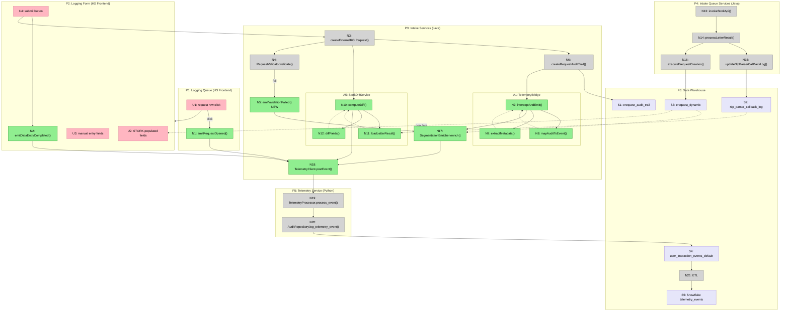

# Intake Event Telemetry POC — Shaping

## Source

> "i'd love to have some visualization of the hot spots in the system and process that are most ripe for easy improvement or massive swings... we could explore data happening in fulfillment qc exceptions that we could creatively hack around"

> "w everything you now know, and with the assumption that we MUST build an event system to cover the gaps and expose in an automated fashion where things are ripe for efficiency and optimization... can you do some shaping to see what we ought to build for the intake process itself as a first pass poc? anything we can piggyback on in audit trail logging would be great, then fill in other gaps per the Taxonomy doc & comments + the needed/helpful metadata wherever we can find it."

> Taxonomy doc proposes 24 instrumentation points across 6 ROI stages. Parking lot includes: "Include request intake processing as stage" and "What is role of audit log vs. event log in the long run?"

---

## Problem

HealthSource processes ~800K human-worked requests/quarter. FTI observed ~7min active work per request; Snowflake shows ~4hr wall-clock. The 35x gap is queue time, routing failures, and data quality errors — but we can't automatically detect or surface these problems because:

1. **Audit trail is rich but unstructured** — 422 event types, 200M+ rows/90d, but freetext messages. Can't aggregate or alert on structured fields.
2. **No time-on-task measurement** — Can't distinguish active work from idle/queue. FTI did stopwatch; we need automated equivalent.
3. **STORK accuracy is a blind spot** — 90% of processors correct STORK fields (FTI). We don't know which fields or how often.
4. **Exception creation is reactive** — "Field Input Required" and "Invalid/Incomplete" make up 33% of exceptions. The missing data is knowable at intake time.
5. **No automated optimization detection** — Site variance (0.2% to 45% issue rates), weekend gaps (4.8x), afternoon queues — all discoverable but require manual queries.

---

## Outcome

A telemetry system for the intake process that:
- Emits structured events to the new `eventdriventelemetry` service (PRs 2577-2586)
- Enables automated detection of efficiency/optimization opportunities
- Piggybacks on existing audit trail where possible (don't re-instrument)
- Fills genuine gaps per Taxonomy doc (STORK edits, field timing, pre-validation)
- Serves as the POC pattern for fulfillment/QC/delivery stages later

---

## Requirements (R)

| ID | Requirement | Status |
|----|-------------|--------|
| R0 | Emit structured intake events to the telemetry service for automated analysis | Core goal |
| R1 | Reuse existing audit trail events where they already capture the right data (don't re-instrument) | Must-have |
| R2 | Capture time-on-task: when processor opens a request and when they finish logging | Must-have |
| R3 | Capture STORK edit tracking: which auto-populated fields the processor changes | Must-have |
| R4 | Capture pre-validation failures as structured data (not freetext exception comments) | Must-have |
| R5 | Every event carries segmentation dimensions (site_id, source_type, major_class, emr_system) | Must-have |
| R6 | Events flow to Snowflake for analysis (via existing or new ETL from hs_audit PostgreSQL) | Must-have |
| R7 | POC scoped to intake/logging only (Stages 1-2 of Taxonomy); pattern reusable for later stages | Must-have |
| R8 | No processor-facing UX changes (zero friction — Taxonomy principle #3) | Must-have |
| R9 | Works within the existing `eventdriventelemetry` service architecture (Python FastAPI + PostgreSQL) | Must-have |

---

## CURRENT: What Exists Today

| Part | Mechanism |
|------|-----------|
| **C1** | **Audit trail (Java → PostgreSQL → Snowflake)**: 30+ intake events in `AuditTrailCache.java`. Writes to `erequest_audit_trail_dynamic`. Freetext `audit_message` with template-based formatting. Already in Snowflake via existing ETL. |
| **C2** | **Telemetry service (Python)**: PRs 2577-2586. FastAPI `POST /api/telemetry/event`. Pydantic schema validation. Writes to `hs_audit.user_interaction_events_default`. JWT auth. 16 ROI event types + 4 generic workflow types defined. |
| **C3** | **Camunda BPMN (Java)**: `logging-subprocess.bpmn` with `loggingTask` (ready to log), `logExceptionTask`, `logHoldTask`. Task lifecycle events (`AuditCamundaTaskEvent` = 55M/90d). |
| **C4** | **Intake queue services (Java)**: Azure Service Bus. STORK integration via `StorkIntegration.java`. OCR/NLP pipeline. `InputReceiverService` routes messages. |
| **C5** | **Validators (Java)**: `RequestValidator` factory → `PayorRequestValidator`, `CIRequestValidator`, `PortalRequestValidator`. Validation failures currently create exceptions, not structured events. |
| **C6** | **EventType enum (Python)**: `types.py` defines `roi.intake.request_opened`, `roi.intake.request_received`, plus 14 other ROI lifecycle events. Metadata supports `request_id`, `task_id`, `workflow_instance_id`, `additional_context` (JSONB). |

---

## A: Audit Trail Bridge + Targeted Frontend Events

Bridge existing Java audit trail writes to the Python telemetry service (structured extraction). Add 4 new frontend events for genuine gaps.

| Part | Mechanism | Flag |
|------|-----------|:----:|
| **A1** | **TelemetryBridge (Java)**: Listener on `RequestAuditTrail.createRequestAuditTrail()`. Maps `audit_type` → telemetry `event_type`. Regex extracts structured metadata from template-based `audit_message`. Async HTTP POST to telemetry service. | |
| **A2** | **Event type extensions (Python)**: Add ~13 intake-specific event types to `types.py` enum (e.g., `roi.intake.requester_resolved`, `roi.intake.request_classified`, `roi.logging.patient_not_found`). Extend metadata schema with intake fields in `additional_context`. | |
| **A3** | **Request opened event (JS)**: Emit `roi.intake.request_opened` when processor clicks into a request from queue. Captures `processor_id`, `time_since_received`. | |
| **A4** | **Data entry completed event (JS)**: Emit `roi.intake.data_entry_completed` on logging form submit. Captures `logging_method` (manual/stork_assisted). | |
| **A5** | **STORK field diff (Java, server-side)**: At logging form submit, load STORK's original `LetterResult` from `nlp_parser_callback_log.parser_callback_response` (already persisted as JSON). Diff against submitted request fields (patient name, DOB, MRN, requester, reason, record types). Emit `roi.intake.stork_fields_edited` with `fields_changed[]`, `field_change_count`. No frontend work needed — diff is server-side. | |
| **A6** | **Validation failure event (Java)**: In `RequestValidator` chain, emit `roi.intake.validation_failed` with structured `missing_fields[]` and `validation_type`. Fires before exception creation. | |
| **A7** | **Segmentation enrichment**: Every bridged/new event carries `site_id`, `source_type`, `major_class`, `is_emr`, `health_system_id` from request context. Lookup at bridge time from `erequest_dynamic`. | |

**A5 resolved**: Spike confirmed STORK response is persisted in `nlp_parser_callback_log.parser_callback_response` as full JSON (`LetterResult`). Diff is computable server-side at form submit time — no frontend work needed for this part.

---

## B: Snowflake CDC (No Java Changes)

Use Snowflake change data capture on `erequest_audit_trail_dynamic` to extract structured events. No Java code changes.

| Part | Mechanism | Flag |
|------|-----------|:----:|
| **B1** | **Snowflake stream + task**: Create a Snowflake stream on `erequest_audit_trail_dynamic`. Scheduled task parses `audit_type` + `audit_message` via SQL regex/UDFs. Writes structured rows to a new `telemetry_events` table. | ⚠️ |
| **B2** | **No new frontend events**: Relies entirely on existing audit trail. Time-on-task estimated from status transitions (existing approach from our analysis). | |
| **B3** | **No STORK tracking**: Cannot capture field-level diffs without frontend instrumentation. | |
| **B4** | **No pre-validation events**: Cannot capture structured validation failures without Java code changes. | |

---

## C: Full Frontend SDK (Taxonomy-Native)

Implement the Taxonomy doc's 24 events as a JavaScript SDK in the HealthSource frontend. Backend receives and stores.

| Part | Mechanism | Flag |
|------|-----------|:----:|
| **C1** | **JS Telemetry SDK**: Library that instruments all Taxonomy Stage 1+2 events from the browser. Auto-captures timestamps, session_id, processor_id. Batches and POSTs to telemetry service. | ⚠️ |
| **C2** | **All 7 Taxonomy intake events**: `request_received`, `request_opened`, `data_entry_completed`, `patient_lookup_initiated`, `patient_matched`, `logging_completed`, plus `auth_review` events. | |
| **C3** | **Tab focus tracking**: `document.visibilitychange` listener for active/idle detection. Emits processor_active/idle events. | |
| **C4** | **STORK diff**: Same as A5 — capture before/after field values. | ⚠️ |
| **C5** | **Ignores existing audit trail**: All events are net-new from frontend. Audit trail continues independently. | |

---

## Fit Check

| Req | Requirement | Status | A | B | C |
|-----|-------------|--------|---|---|---|
| R0 | Emit structured intake events to the telemetry service for automated analysis | Core goal | ✅ | ✅ | ✅ |
| R1 | Reuse existing audit trail events where they already capture the right data | Must-have | ✅ | ✅ | ❌ |
| R2 | Capture time-on-task: when processor opens request and finishes logging | Must-have | ✅ | ❌ | ✅ |
| R3 | Capture STORK edit tracking: which auto-populated fields processor changes | Must-have | 🟡 ✅ | ❌ | ❌ |
| R4 | Capture pre-validation failures as structured data | Must-have | ✅ | ❌ | ✅ |
| R5 | Every event carries segmentation dimensions | Must-have | ✅ | ✅ | ✅ |
| R6 | Events flow to Snowflake for analysis | Must-have | ✅ | ✅ | ✅ |
| R7 | POC scoped to intake/logging only; pattern reusable | Must-have | ✅ | ✅ | ✅ |
| R8 | No processor-facing UX changes | Must-have | ✅ | ✅ | ✅ |
| R9 | Works within existing telemetry service architecture | Must-have | ✅ | ❌ | ✅ |

**Notes:**
- 🟡 **A now passes R3**: Spike confirmed STORK `LetterResult` is persisted in `nlp_parser_callback_log.parser_callback_response`. Server-side diff at form submit — no frontend work needed.
- **B/C still fail R3**: B has no frontend instrumentation; C has same flag (C4 ⚠️) but could use same approach as A if selected.
- **B fails R2**: Can't measure time-on-task without frontend events. Status transitions give wall-clock (which we already have), not active time.
- **B fails R4**: Can't capture structured validation failures without Java changes.
- **B fails R9**: Writes to Snowflake directly, not through the telemetry service. Bypasses the architecture the team is building.
- **C fails R1**: Ignores existing audit trail entirely. Re-instruments what already exists. Duplicates ~70% of events.

---

## Decision

🟡 **Shape A passes all 9 requirements.** It's the only shape that does. No remaining flags.

Shape B is cheap but misses the highest-value events (time-on-task, STORK, pre-validation). Shape C is comprehensive but violates the "don't re-instrument" principle and is significantly more work for the POC.

### Spike Resolved: STORK Field Persistence ✅

| # | Question | Answer |
|---|----------|--------|
| **S1-Q1** | Where is the STORK response stored? | `nlp_parser_callback_log.parser_callback_response` — full `LetterResult` JSON |
| **S1-Q2** | Does `BeginStorkProcessingStep` persist before processor sees values? | Yes — `LetterResultService.updateNlpParserCallBackLog()` persists the entire response before `CreateErequestHandler` populates the request |
| **S1-Q3** | Can we access both original STORK and edited values at submit? | Yes — original in `parser_callback_response`, edited in submitted request fields |
| **S1-Q4** | Do we need a new snapshot step? | No — already persisted |

**Implication for A5**: STORK diff is server-side Java work, not frontend. At form submit, load `parser_callback_response`, deserialize `LetterResult`, compare `patient.*`, `requester.*`, `requestDetails.*`, `recordTypes[]` against submitted values. Emit structured diff as telemetry event.

---

## Detail A: Breadboard

### Places

| # | Place | Description |
|---|-------|-------------|
| P1 | Logging Queue (HS Frontend) | Task list where processor picks next request |
| P2 | Logging Form (HS Frontend) | Data entry screen — STORK may pre-populate fields |
| P3 | Intake Services (Java) | API layer: validation, audit trail, request persistence |
| P4 | Intake Queue Services (Java) | STORK integration, OCR/NLP pipeline |
| P5 | Telemetry Service (Python) | Event validation + persistence (PRs 2577-2586) |
| P6 | Data Warehouse | PostgreSQL `hs_audit` + Snowflake (analysis destination) |

### UI Affordances

| # | Place | Component | Affordance | Control | Wires Out | Returns To |
|---|-------|-----------|------------|---------|-----------|------------|
| U1 | P1 | task-list | request row | click | → N1, → P2 | — |
| U2 | P2 | logging-form | STORK-populated fields (patient, requester, reason) | render | — | — |
| U3 | P2 | logging-form | manual entry fields | type | — | — |
| U4 | P2 | logging-form | submit button | click | → N2, → N3 | — |

### Code Affordances

| # | Place | Component | Affordance | Control | Wires Out | Returns To |
|---|-------|-----------|------------|---------|-----------|------------|
| **A3: Request opened** | | | | | | |
| N1 | P1 | telemetry-js | `emitRequestOpened()` | call | → N20 | — |
| **A4: Data entry completed** | | | | | | |
| N2 | P2 | telemetry-js | `emitDataEntryCompleted()` | call | → N20 | — |
| **Existing intake flow** | | | | | | |
| N3 | P3 | ROIRequestController | `createExternalROIRequest()` | call | → N4, → N5, → N8, → N10 | — |
| N4 | P3 | RequestValidator | `validate()` | call | → N5 (on fail) | — |
| **A6: Validation failure** | | | | | | |
| N5 | P3 | RequestValidator | `emitValidationFailed()` **NEW** | call | → N18 | — |
| **Existing audit trail** | | | | | | |
| N6 | P3 | RequestAuditTrail | `createRequestAuditTrail(entry)` | call | → S1, → N7 | — |
| **A1: Telemetry Bridge** | | | | | | |
| N7 | P3 | TelemetryBridge | `interceptAndEmit(auditEntry)` **NEW** | call | → N8, → N18 | — |
| N8 | P3 | TelemetryBridge | `mapAuditToEvent(audit_type)` **NEW** | call | — | → N7 |
| N9 | P3 | TelemetryBridge | `extractMetadata(audit_message)` **NEW** | call | — | → N7 |
| **A5: STORK field diff** | | | | | | |
| N10 | P3 | StorkDiffService | `computeDiff(eRequestId)` **NEW** | call | → N11, → N12, → N18 | — |
| N11 | P3 | StorkDiffService | `loadLetterResult(eRequestId)` **NEW** | call | — | → N10 |
| N12 | P3 | StorkDiffService | `diffFields(letterResult, submittedRequest)` **NEW** | call | — | → N10 |
| **Existing STORK pipeline** | | | | | | |
| N13 | P4 | StorkIntegration | `invokeStorkApi(request)` | call | — | → N14 |
| N14 | P4 | LetterResultService | `processLetterResult(lr)` | call | → N15, → S2 | — |
| N15 | P4 | LetterResultService | `updateNlpParserCallBackLog(lr)` | call | → S2 | — |
| N16 | P4 | CreateErequestHandler | `executeErequestCreation(lr)` | call | → S3 | → U2 |
| **A7: Segmentation enrichment** | | | | | | |
| N17 | P3 | SegmentationEnricher | `enrich(event, eRequestId)` **NEW** | call | — | → N18 |
| **A2: Event type extensions + telemetry persistence** | | | | | | |
| N18 | P3 | TelemetryClient | `postEvent(telemetryEvent)` **NEW** | call | → N19 | — |
| N19 | P5 | TelemetryProcessor | `process_event(event_data)` | call | → N20 | — |
| N20 | P5 | AuditRepository | `log_telemetry_event(event)` | call | → S4 | — |
| **Data warehouse** | | | | | | |
| N21 | P6 | ETL | Snowflake ingestion from `hs_audit` | scheduled | → S5 | — |

### Data Stores

| # | Place | Store | Description |
|---|-------|-------|-------------|
| S1 | P3 | `erequest_audit_trail` | Existing audit trail (422 event types, freetext) |
| S2 | P4 | `nlp_parser_callback_log.parser_callback_response` | STORK `LetterResult` JSON (persisted before processor sees fields) |
| S3 | P3 | `erequest_dynamic` | Request metadata (site_id, source_type, major_class, is_emr) |
| S4 | P6 | `hs_audit.user_interaction_events_default` | Telemetry events (structured, JSONB metadata) |
| S5 | P6 | Snowflake `telemetry_events` | Analysis-ready table |

### Wiring Narrative

**Flow 1 — Processor opens request (A3)**
```
U1 (click row) → N1 emitRequestOpened() → N20 persist
                → P2 (navigate to form)
```
N1 captures: `processor_id`, `request_id`, timestamp. N17 enriches with segmentation from S3.

**Flow 2 — Existing audit trail events get bridged (A1)**
```
N3 (request creation) → N6 createRequestAuditTrail()
                           → S1 (existing write, unchanged)
                           → N7 interceptAndEmit()
                               → N8 mapAuditToEvent() → event_type
                               → N9 extractMetadata() → structured fields
                               → N17 enrich() → segmentation dims from S3
                               → N18 postEvent() → N19 → N20 → S4
```
This is the core bridge. Every existing audit write additionally emits a structured telemetry event. ~30 audit types mapped.

**Flow 3 — Processor submits form (A4 + A5)**
```
U4 (click submit) → N2 emitDataEntryCompleted() → N20 persist
                   → N3 createExternalROIRequest()
                       → N10 computeDiff()
                           → N11 loadLetterResult() from S2
                           → N12 diffFields(lr vs submitted)
                           → N18 postEvent(stork_fields_edited) → S4
```
STORK diff happens server-side at the same time as the existing request creation flow.

**Flow 4 — Validation fails (A6)**
```
N3 → N4 validate()
        → [fail] N5 emitValidationFailed(missing_fields[])
                     → N17 enrich() → N18 → N19 → N20 → S4
        → [fail] existing exception creation (unchanged)
```
Validation failure telemetry fires *before* the exception is created. Structured `missing_fields[]` replaces freetext.

**Flow 5 — STORK pipeline (existing, unchanged)**
```
N13 invokeStorkApi() → STORK service (external)
    → callback → N14 processLetterResult()
                    → N15 persistResponse() → S2
                    → N16 createErequest() → S3 → U2 (fields rendered)
```
No changes to STORK pipeline. We just read from S2 later in Flow 3.

### Mermaid Diagram



**Legend**: Green = new code (Shape A). Grey = existing code. Pink = UI. Purple = data stores.

---

## Slicing

### Slice Summary

| # | Slice | Part | Affordances | Demo |
|---|-------|------|-------------|------|
| V1 | Bridge emits events for existing audit trail | A1, A2, A7 | N6→N7→N8→N9→N17→N18→N19→N20→S4 | "Requester lookup triggers structured telemetry event in hs_audit table" |
| V2 | Request opened + data entry timing | A3, A4 | U1→N1, U4→N2, →N18→S4 | "Open request, fill form, submit — two time-bracketed events in telemetry table" |
| V3 | STORK field diff | A5 | N10→N11→N12→N18→S4 | "Submit form, see `fields_changed: ['patient.lastName', 'requestDetails.reason']` in event metadata" |
| V4 | Validation failure events | A6 | N4→N5→N17→N18→S4 | "Submit with missing address — structured `validation_failed` event before exception created" |
| V5 | Snowflake pipeline + dashboard | (R6) | S4→N21→S5, dashboard | "Snowflake query: intake events by site × major_class, STORK edit rates" |

### Per-Slice Affordances

**V1: Bridge emits events** (A1, A2, A7 — weeks 1-2)

| # | Component | Affordance | Control | Wires Out | Returns To |
|---|-----------|------------|---------|-----------|------------|
| N7 | TelemetryBridge | `interceptAndEmit(auditEntry)` | call | → N8, → N9, → N17, → N18 | — |
| N8 | TelemetryBridge | `mapAuditToEvent(audit_type)` | call | — | → N7 |
| N9 | TelemetryBridge | `extractMetadata(audit_message)` | call | — | → N7 |
| N17 | SegmentationEnricher | `enrich(event, eRequestId)` | call | — | → N18 |
| N18 | TelemetryClient | `postEvent(telemetryEvent)` | call | → N19 | — |
| N19 | TelemetryProcessor | `process_event()` (extend types.py) | call | → N20 | — |
| N20 | AuditRepository | `log_telemetry_event()` | call | → S4 | — |

Demo: Create a request via existing intake flow. Show `hs_audit.user_interaction_events_default` now has structured `roi.intake.requester_resolved` event with `{requester_id, delivery_method, site_id, source_type, major_class}` in JSONB metadata.

**V2: Request opened + data entry timing** (A3, A4 — week 3)

| # | Component | Affordance | Control | Wires Out | Returns To |
|---|-----------|------------|---------|-----------|------------|
| N1 | telemetry-js | `emitRequestOpened()` | call | → N18 | — |
| N2 | telemetry-js | `emitDataEntryCompleted()` | call | → N18 | — |

Demo: Open request from queue, fill form, submit. Query telemetry table: `SELECT event_type, event_timestamp FROM ... WHERE request_id = X ORDER BY event_timestamp` shows `request_opened` and `data_entry_completed` with measurable delta = actual logging time.

**V3: STORK field diff** (A5 — week 3)

| # | Component | Affordance | Control | Wires Out | Returns To |
|---|-----------|------------|---------|-----------|------------|
| N10 | StorkDiffService | `computeDiff(eRequestId)` | call | → N11, → N12, → N18 | — |
| N11 | StorkDiffService | `loadLetterResult(eRequestId)` | call | — | → N10 |
| N12 | StorkDiffService | `diffFields(lr, submitted)` | call | — | → N10 |

Demo: STORK pre-populates patient name "JOHN SMITH". Processor corrects to "JOHNATHAN SMITH". Event metadata shows `{fields_changed: ["patient.firstName"], field_change_count: 1, stork_fully_logged: true}`.

**V4: Validation failure events** (A6 — week 4)

| # | Component | Affordance | Control | Wires Out | Returns To |
|---|-----------|------------|---------|-----------|------------|
| N5 | RequestValidator | `emitValidationFailed(failures)` | call | → N17, → N18 | — |

Demo: Submit request missing requester address. Telemetry table shows `roi.intake.validation_failed` with `{missing_fields: ["requester_address"], validation_type: "field_input_required", site_id: "S32"}` — structured replacement for freetext exception comment "Requester address is missing".

**V5: Snowflake pipeline + dashboard** (R6 — week 4)

| # | Component | Affordance | Control | Wires Out | Returns To |
|---|-----------|------------|---------|-----------|------------|
| N21 | ETL | Snowflake ingestion | scheduled | → S5 | — |

Demo: Snowflake dashboard showing: intake event volume by site, STORK edit rate by field, validation failure reasons breakdown, time-to-open distribution by day_of_week.

---

## Open Questions

1. **Snowflake ETL**: Does the existing ETL from `hs_audit` PostgreSQL → Snowflake already cover `user_interaction_events_default`? If not, that's a dependency for V5.
2. **Session ID**: The telemetry schema requires `sess_UUID`. Where does session tracking live in HealthSource? Is there an existing session concept in the Java frontend we can reuse?
3. **Async bridge transport**: Should the Java→Python bridge use direct HTTP or Azure Service Bus (already exists for intake)? HTTP for POC, queue for prod?
4. **Volume**: ~3M events/quarter for intake alone (~500 bytes/event = ~1.5 GB/quarter). Within capacity?
