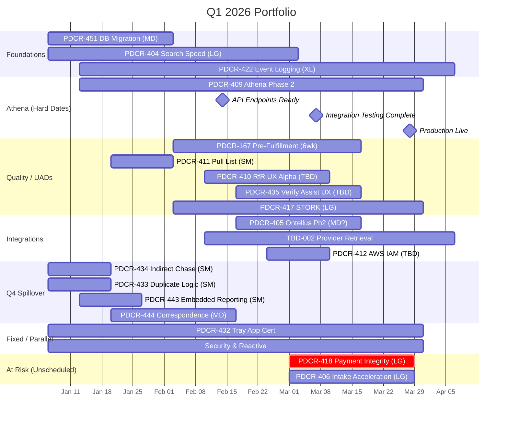

# Portfolio Timeline

## Q1 2026 Gantt

## Key Milestones

| Date | Project | Milestone | Status |
|------|---------|-----------|--------|
| Jan 6 | PDCR-434 | Indirect Chase pilot begins | Pending |
| Feb 14 | PDCR-409 | HS API endpoints ready for Athena integration testing | Pending |
| Mar 7 | PDCR-409 | Integration testing complete, hand off to Athena validation | Pending |
| Mar 28 | PDCR-409 | Production live, begin customer testing | Pending |
| TBD | PDCR-432 | Tray App cert updated before expiry | Pending |

## By Pod Allocation

| Pod | Projects | Total Sprints (Est) |
|-----|----------|---------------------|
| Platform | DB Space, Tray App Cert, Athena Ph2, Intake Accel, Ontellus | ~12 + fixed |
| Intake & Logging | Event Logging, Search Speed, STORK, Pull List, RfR UX | ~11 |
| Fulfillment & QC | Event Logging, Search Speed, Pre-Fulfill Review, Correspondence, AWS IAM | ~10 |
| KTLO | Tray App Cert, Embedded Reporting | ~3 |
| Newfire | Duplicate Logic | ~1 |

## Fixed Allocations (ongoing)

| Item | Sprints | Pod |
|------|---------|-----|
| Security (Sailpoint, vulns) | 12 (2/wk) | Platform |
| Reactive Work | 42 (7/wk) | Mixed |
| PTO | 10.8 | All |

## Dependencies to Track

- PDCR-422 (Event Logging) — J-Welch scoping, but PRD is workable
- PDCR-167 (Pre-Fulfillment) — waiting on designs
- PDCR-412 (AWS IAM) — needs Michael & Jenny sync
- PDCR-410 (RfR UX) — needs Paul/Jen M discussion
- PDCR-417 (STORK) — needs DS team sync
- PDCR-405 (Ontellus) — scope unclear (2 vs 9 sprint delta)

## Notes

- Dates are estimates based on current info; many need workshopping
- "At Risk" section shows unscheduled items with scope questions
- TBD-001 (Payer ERM), TBD-003 (DAQARI Ph1) not shown — need scoping
